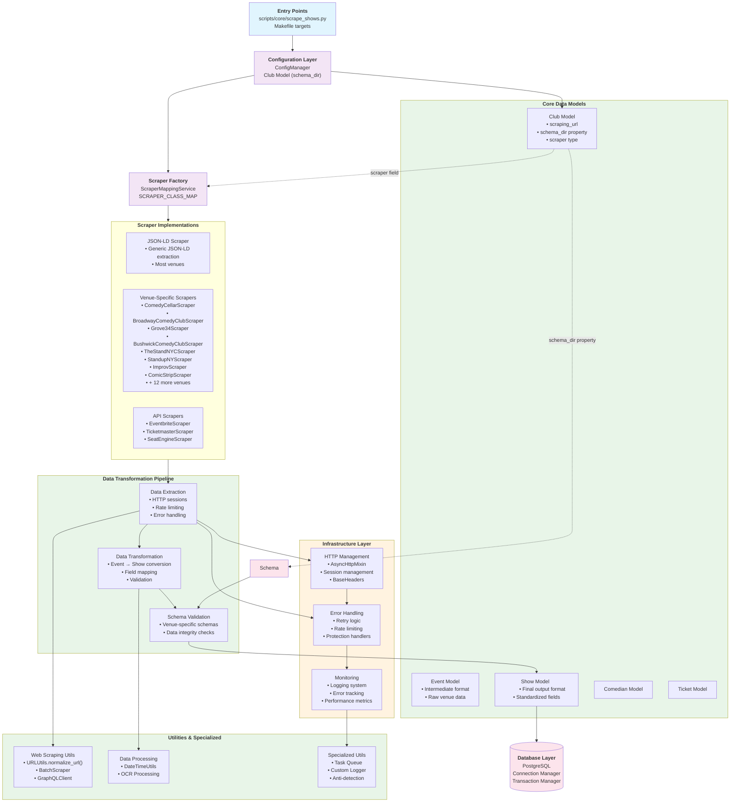
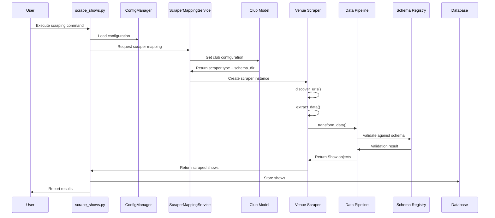
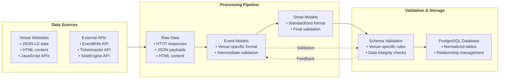

# Laughtrack Scraper System Architecture

This document provides a comprehensive system architecture diagram for the Laughtrack Scraper project, showing the relationships between components and data flow.

## High-Level System Architecture



## Component Interaction Flow



## Data Flow Architecture



## Key Architectural Patterns

### 1. Factory Pattern

- **ScraperMappingService** maps scraper names to classes
- **SCRAPER_CLASS_MAP** maintains type-safe registry
- Enables dynamic scraper instantiation

### 2. Strategy Pattern

- **URL Discovery Strategies**: static, pagination, calendar, api_discovery
- **Data Transformation Strategies**: JSON-LD, GraphQL, API responses
- **Error Handling Strategies**: retry, circuit breaker, fallback

### 3. Pipeline Pattern

- **Data Transformation Pipeline**: extract → transform → validate → store
- **Pluggable Transformers**: venue-specific logic encapsulation
- **Validation Pipeline**: schema-based data integrity

### 4. Mixin Pattern

- **AsyncHttpMixin**: HTTP session management
- **Reusable across all scrapers**
- **Consistent timeout and header configuration**

## Directory Structure Mapping

```text
laughtrack-scraper/
├── scripts/core/                    # Entry points
├── src/laughtrack/
│   ├── core/                       # Core business logic
│   │   ├── models/                 # Data models
│   │   └── services/               # Business services
│   ├── scrapers/                   # Scraper implementations
│   │   ├── base/                   # Base classes & mixins
│   │   ├── implementations/        # Specific scrapers
│   │   └── utils/                  # Scraper utilities
│   ├── infrastructure/             # Infrastructure concerns
│   │   ├── config/                 # Configuration management
│   │   ├── http/                   # HTTP utilities
│   │   └── monitoring/             # Monitoring & alerts
│   ├── data/                       # Data access layer
│   │   ├── handlers/               # Database handlers
│   │   └── queries/                # SQL queries
│   └── utils/                      # General utilities
├── data/schemas/                   # Schema definitions
└── tests/                         # Test suites
```

## Task → Component Mapping

| Task Type | Primary Components | Key Files |
|-----------|-------------------|-----------|
| **Add New Scraper** | Club Model → ScraperMapping → Scraper Class | `core/models/club.py`, `core/services/scraper_mapping.py`, `scrapers/implementations/venues/` |
| **Debug Data Issues** | Schema Registry → Scraper Implementation → Data Transform | `data/schemas/{venue}/`, specific scraper files |
| **Fix HTTP Issues** | AsyncHttpMixin → BaseHeaders → Error Handling | `core/data/mixins/async_http_mixin.py`, `infrastructure/http/` |
| **Add New Venue** | Database → Club Config → Schema → Scraper | Club table, `data/schemas/{hostname}/`, new scraper class |
| **Performance Tuning** | Rate Limiter → Batch Scraper → Monitoring | `scrapers/utils/rate_limiting.py`, `utilities/infrastructure/scraper/scraper.py` |

---

*This architecture diagram was generated based on the actual codebase structure as of July 7, 2025.*
