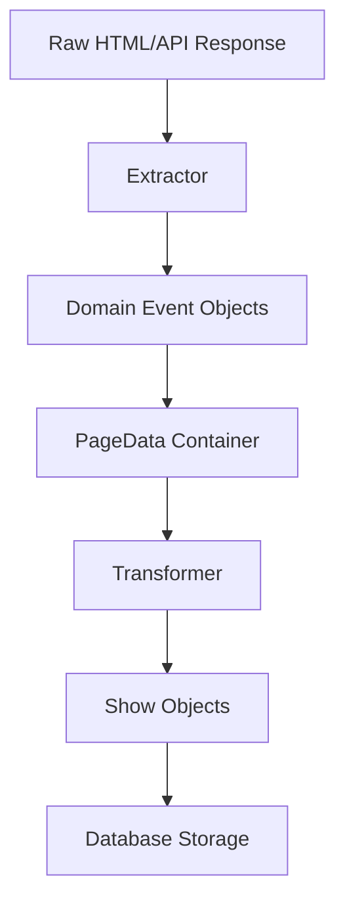

# Scraper Architecture Patterns Documentation

This document analyzes and documents the architecture patterns found in the Laughtrack scraper implementations, providing a reference for applying consistent architectural patterns across all scrapers.

## Architecture Overview

All scrapers follow a standardized **5-Component Architecture** with clear separation of concerns:

```
┌─────────────────┐    ┌─────────────────┐    ┌─────────────────┐
│   BaseScraper   │    │   PageData      │    │  Transformer    │
│   (Orchestra-   │    │   (Data Model)  │    │  (Data Convert) │
│   tion)         │    │                 │    │                 │
└─────────────────┘    └─────────────────┘    └─────────────────┘
         │                       │                       │
         │                       │                       │
         ▼                       ▼                       ▼
┌─────────────────┐    ┌─────────────────┐
│   Extractor     │    │   Event Models  │
│   (Data Extract)│    │   (Domain Data) │
│                 │    │                 │
└─────────────────┘    └─────────────────┘
```

## Core Architectural Patterns

### 1. Standardized File Structure

**All scraper directories contain exactly 5 files:**

```
scraper_name/
├── __init__.py         # Module exports
├── scraper.py          # Main orchestration class
├── extractor.py        # Raw data extraction logic
├── transformer.py      # Data transformation to Show objects
└── page_data.py        # Data models for extracted data
```

### 2. Single Responsibility Principle

Each component has a single, well-defined responsibility:

| Component | Responsibility | Input | Output |
|-----------|---------------|--------|---------|
| **Scraper** | Orchestration & workflow management | Club config | List[Show] |
| **Extractor** | Raw data extraction from sources | HTML/API responses | Domain event objects |
| **Transformer** | Data conversion to standard format | Domain event objects | Show objects |
| **PageData** | Data structure for extracted data | - | Data containers |
| **Event Models** | Domain-specific data representations | Raw JSON/HTML | Structured objects |

### 3. BaseScraper Pipeline Pattern

All scrapers inherit from `BaseScraper` and follow the standard pipeline:

```python
class VenueScraper(BaseScraper):
    key = "venue_identifier"  # Must match club.scraper field
    
    def __init__(self, club: Club):
        super().__init__(club)
        self.transformer = VenueTransformer(club)
    
    # Pipeline methods (required)
    async def extract_data(self, url: str) -> Optional[VenuePageData]:
        """Extract raw data from source"""
    
    async def transform_data(self, raw_data: VenuePageData, source_url: str) -> List[Show]:
        """Transform to Show objects"""
```

**Pipeline Flow:**
1. `discover_urls()` → List of URLs to process
2. `extract_data(url)` → Raw data extraction (per URL)
3. `transform_data(raw_data, url)` → Data transformation (per URL)
4. `scrape_async()` → Orchestrates the full pipeline

## Scraper Implementation Patterns

### Pattern A: JSON-LD Scraper (Generic)

**Use Case:** Standard JSON-LD structured data extraction
**Example:** `json_ld/scraper.py`

**Characteristics:**
- Generic pattern for venues using JSON-LD
- Simple HTML parsing → JSON-LD extraction
- Standard Event objects → Show transformation
- Minimal venue-specific logic

```python
async def extract_data(self, url: str) -> Optional[JsonLdPageData]:
    html_content = await self.fetch_html(URLUtils.normalize_url(url))
    event_list = JsonLdEventExtractor.extract_events(html_content, extract_events_only=True)
    return JsonLdPageData(event_list=event_list) if event_list else None
```

**Architecture:**
- **Extractor:** `JsonLdEventExtractor` - Parses HTML for JSON-LD scripts
- **PageData:** `JsonLdPageData` - Contains list of Event objects
- **Transformer:** `JSONLdTransformer` - Event → Show conversion
- **Domain Model:** Standard `Event` objects

### Pattern B: JavaScript Array Extraction

**Use Case:** Venues with event data in JavaScript arrays
**Example:** `broadway_comedy_club/scraper.py`

**Characteristics:**
- HTML parsing → JavaScript array extraction
- Custom domain objects for venue-specific data
- API enrichment (Tessera ticket data)
- Complex data processing pipeline

```python
async def extract_data(self, url: str) -> Optional[BroadwayPageData]:
    html_content = await self.fetch_html(URLUtils.normalize_url(url))
    event_list = BroadwayEventExtractor.extract_events(html_content)
    enriched_events = await self._enrich_events_with_tickets(event_list)
    return BroadwayPageData(event_list=enriched_events) if enriched_events else None
```

**Architecture:**
- **Extractor:** `BroadwayEventExtractor` - JavaScript regex parsing
- **PageData:** `BroadwayPageData` - Contains list of BroadwayEvent objects
- **Transformer:** `BroadwayEventTransformer` - BroadwayEvent → Show conversion
- **Domain Model:** `BroadwayEvent` (venue-specific data model)
- **External Client:** `BroadwayTesseraClient` for ticket enrichment

### Pattern C: Multi-Step API Workflow

**Use Case:** Complex API authentication and data retrieval
**Example:** `comedy_cellar/scraper.py`

**Characteristics:**
- Multi-step API authentication workflow
- Parallel API requests (lineup + shows data)
- Complex session management
- Batch processing with conservative rate limiting

```python
async def extract_data(self, url: str) -> Optional[ComedyCellarPageData]:
    # Multi-step API workflow handled by extractor
    return await self.extractor.extract_combined_data(url)
```

**Architecture:**
- **Extractor:** `ComedyCellarExtractor` - Complex API workflow orchestration
- **PageData:** `ComedyCellarPageData` - Combined API response data
- **Transformer:** `ComedyCellarEventTransformer` - API data → Show conversion
- **Domain Model:** Complex TypedDict structures for API responses
- **Session Management:** Custom session handling for API authentication

### Pattern D: External API Integration

**Use Case:** Venues using third-party API systems (Wix, etc.)
**Example:** `bushwick/scraper.py`

**Characteristics:**
- OAuth or token-based API authentication
- External API client integration
- API-first data extraction (no HTML parsing)
- Token refresh and session management

```python
async def discover_urls(self) -> List[str]:
    await self._ensure_authenticated()
    return [self._build_wix_api_url()]

async def extract_data(self, url: str) -> Optional[BushwickPageData]:
    api_response = await self._fetch_wix_events()
    event_list = BushwickEventExtractor.extract_events(api_response)
    return BushwickPageData(event_list=event_list) if event_list else None
```

**Architecture:**
- **Extractor:** `BushwickEventExtractor` - API response processing
- **PageData:** `BushwickPageData` - Contains list of BushwickEvent objects
- **Transformer:** `BushwickEventTransformer` - BushwickEvent → Show conversion
- **Domain Model:** `BushwickEvent` (API-specific data model)
- **Authentication:** Token-based auth with refresh logic

## Data Flow Architecture

### Standard Pipeline Flow

```mermaid
graph LR
    A[Club Config] --> B[BaseScraper]
    B --> C[discover_urls]
    C --> D[extract_data]
    D --> E[Extractor]
    E --> F[PageData]
    F --> G[transform_data]
    G --> H[Transformer]
    H --> I[List[Show]]
```

### Data Transformation Layers



## Component Implementation Guidelines

### 1. Scraper Class Requirements

```python
class VenueScraper(BaseScraper):
    key = "venue_key"  # REQUIRED: Must match Club.scraper field
    
    def __init__(self, club: Club):
        super().__init__(club)
        self.transformer = VenueTransformer(club)
        # Initialize venue-specific components
    
    async def extract_data(self, url: str) -> Optional[VenuePageData]:
        """REQUIRED: Extract raw data from URL"""
        pass
    
    async def transform_data(self, raw_data: VenuePageData, source_url: str) -> List[Show]:
        """REQUIRED: Transform raw data to Show objects"""
        pass
    
    async def discover_urls(self) -> List[str]:
        """OPTIONAL: Custom URL discovery logic"""
        return [self.club.scraping_url]  # Default: use club URL
```

**Key Requirements:**
- Must inherit from `BaseScraper`
- Must define unique `key` attribute
- Must implement `extract_data()` and `transform_data()` methods
- Should use `URLUtils.normalize_url()` for all URLs
- Must use `self.transformer` for data transformation

### 2. Extractor Class Pattern

```python
class VenueEventExtractor:
    """Utility class for extracting venue-specific event data."""
    
    @staticmethod
    def extract_events(source_data: str) -> List[VenueEvent]:
        """
        Extract venue events from source data.
        
        Args:
            source_data: HTML content, API response, etc.
            
        Returns:
            List of venue-specific event objects
        """
        pass
    
    @staticmethod  
    def _parse_venue_specific_format(data: str) -> List[Dict]:
        """Private helper methods for venue-specific parsing logic."""
        pass
```

**Key Requirements:**
- Static methods for stateless data extraction
- Return venue-specific domain objects (not Show objects)
- Handle parsing errors gracefully with logging
- Use descriptive method names for venue-specific logic
- Only Extractors may depend on `HtmlScraper`; do not import BeautifulSoup directly outside `HtmlScraper`.
- Prefer `HtmlScraper` helpers (find/select/extract) for any HTML parsing to keep parsing centralized.

### 3. Transformer Class Pattern

```python
class VenueEventTransformer(DataTransformer[VenueEvent]):
    """Transformer for converting VenueEvent objects to Show objects."""
    
    def can_transform(self, raw_data: VenueEvent) -> bool:
        """Check if this transformer can handle the given data."""
        return isinstance(raw_data, VenueEvent) and hasattr(raw_data, 'name')
    
    def transform_to_shows(self, raw_data: VenueEvent, source_url: str) -> List[Show]:
        """Transform VenueEvent to Show objects."""
        try:
            show = Show.from_event(raw_data, self.club, enhanced=True, source_url=source_url)
            return [show]
        except Exception as e:
            Logger.error(f"Failed to transform VenueEvent data: {e}")
            return []
```

**Key Requirements:**
- Inherit from `DataTransformer[DomainEventType]`
- Implement `can_transform()` for data validation
- Implement `transform_to_shows()` for Show object creation
- Use `Show.from_event()` with `enhanced=True` when possible
- Handle transformation errors gracefully with logging

### 4. PageData Model Pattern

```python
@dataclass
class VenuePageData:
    """
    Data model representing raw extracted data from venue pages.
    """
    event_list: List[VenueEvent]
    
    def has_json_ld_data(self) -> bool:
        """Check if the scraped page contains any event data."""
        return bool(self.event_list)
    
    def get_event_count(self) -> int:
        """Get the number of events found on the page."""
        return len(self.event_list)
```

**Key Requirements:**
- Use `@dataclass` decorator for simple data containers
- Contain lists of domain event objects (not Show objects)
- Provide convenience methods for data validation
- Use descriptive naming that matches the venue

### 5. Domain Event Model Pattern

```python
@dataclass
class VenueEvent:
    """
    Data model representing a single event from venue-specific sources.
    """
    id: str
    title: str
    date_time: str
    description: Optional[str] = None
    ticket_info: Optional[Dict[str, Any]] = None
    
    # Raw data preservation for debugging
    _raw_data: Optional[Dict[str, Any]] = None
```

**Key Requirements:**
- Use `@dataclass` for structured data
- Include required fields: id, title, date_time
- Preserve raw data for debugging (`_raw_data`)
- Use venue-specific field names that match source data

## Error Handling and Logging Patterns

### Standardized Error Handling

```python
async def extract_data(self, url: str) -> Optional[VenuePageData]:
    try:
        # Main extraction logic
        html_content = await self.fetch_html(URLUtils.normalize_url(url))
        event_list = VenueEventExtractor.extract_events(html_content)
        return VenuePageData(event_list=event_list) if event_list else None
        
    except Exception as e:
        Logger.error(f"Error extracting data from {url}: {str(e)}", self.logger_context)
        return None
```

**Key Requirements:**
- Use `Logger` for all logging (not standard `logging`)
- Include `self.logger_context` for consistent logging context
- Return `None` or empty lists on errors (don't raise exceptions)
- Log specific error details with URL context

### Logging Context Pattern

```python
class VenueScraper(BaseScraper):
    def __init__(self, club: Club):
        super().__init__(club)
        # logger_context inherited from BaseScraper
        self.custom_context = {"venue_type": "specific_venue"}
```

**Key Requirements:**
- Use inherited `self.logger_context` from BaseScraper
- Add venue-specific context when needed
- Include relevant debugging information (URLs, response sizes, etc.)

## HTTP and Session Management Patterns

### Standardized HTTP Operations

```python
# ✅ CORRECT: Use BaseScraper's built-in methods
html_content = await self.fetch_html(URLUtils.normalize_url(url))
json_data = await self.fetch_json(api_url)
post_response = await self.post_json(api_url, payload)

# ❌ INCORRECT: Manual session management
session = aiohttp.ClientSession()
async with session.get(url) as response:
    content = await response.text()
```

**Key Requirements:**
- Always use `BaseScraper`'s built-in HTTP methods
- Always normalize URLs with `URLUtils.normalize_url()`
- Let BaseScraper handle session management and cleanup
- Use appropriate method for data type (`fetch_html`, `fetch_json`, `post_json`)

### Advanced Session Management (When Required)

```python
# For complex authentication or custom headers
session = await self.get_session()
headers = BaseHeaders.get_venue_headers('venue_type', domain=self.club.scraping_url)
async with session.post(url, json=data, headers=headers) as response:
    return await response.json()
```

**Key Requirements:**
- Use `await self.get_session()` for custom operations
- Use `BaseHeaders.get_venue_headers()` for consistent headers
- Let BaseScraper handle session cleanup automatically

## Rate Limiting and Performance Patterns

### Conservative Rate Limiting

```python
# For sensitive APIs (Comedy Cellar pattern)
self.batch_scraper = BatchScraper(
    config=get_conservative_config(),  # 2 concurrent, 1.0s delay, batched
    logger_context={"club": club.name, "scraper": self.key}
)
```

### Standard Rate Limiting

```python
# For most venues (Broadway pattern)
self.batch_scraper = BatchScraper(
    config=get_comedy_venue_config(),  # 5 concurrent, 0.5s delay
    logger_context={"club": club.name, "scraper": self.key}
)
```

**Key Requirements:**
- Use `BatchScraper` for multi-URL processing
- Choose appropriate config for venue sensitivity
- Include logging context for debugging
- Never use manual `asyncio.gather()` or `asyncio.Semaphore()`

## Testing and Validation Patterns

### Mock-Based Testing

```python
@pytest.fixture
def mock_venue_response():
    return """<html><!-- venue-specific test data --></html>"""

@pytest.mark.asyncio
async def test_extract_data(venue_scraper, mock_venue_response):
    with patch.object(venue_scraper, 'fetch_html', return_value=mock_venue_response):
        result = await venue_scraper.extract_data('https://test.com')
        assert isinstance(result, VenuePageData)
        assert len(result.event_list) > 0
```

**Key Requirements:**
- Mock HTTP requests, never make real network calls
- Test with realistic venue-specific data
- Validate PageData objects and Show object transformations
- Test error conditions and edge cases

## Migration Guidelines

### Adding a New Scraper

1. **Create directory structure:**
   ```
   venues/new_venue/
   ├── __init__.py
   ├── scraper.py        # Main orchestration
   ├── extractor.py      # Data extraction logic
   ├── transformer.py    # Data transformation
   └── page_data.py      # Data models
   ```

2. **Choose appropriate pattern:**
   - **Pattern A (JSON-LD):** For standard JSON-LD venues
   - **Pattern B (JavaScript):** For JavaScript array extraction  
   - **Pattern C (Multi-API):** For complex API workflows
   - **Pattern D (External API):** For third-party APIs

3. **Implement required components:**
   - Scraper with `key` and pipeline methods
   - Extractor with venue-specific extraction logic
   - Transformer inheriting from `DataTransformer`
   - PageData model with event list container
   - Domain event model for venue-specific data

4. **Add to scraper mapping:**
   ```python
   # In scraper_mapping.py
   SCRAPER_CLASS_MAP = {
       "new_venue": NewVenueScraper,
       # ... existing scrapers
   }
   ```

### Migrating Existing Scrapers

1. **Analyze current scraper:** Identify which pattern it matches
2. **Create new structure:** Use appropriate pattern as template
3. **Extract components:** Separate extraction, transformation, and data models
4. **Update tests:** Ensure test coverage for new component structure
5. **Validate functionality:** Run tests to ensure equivalent behavior

## Best Practices Summary

### Architecture Principles
- **Single Responsibility:** Each component has one clear purpose
- **Separation of Concerns:** Extraction ≠ Transformation ≠ Orchestration
- **Standardization:** All scrapers follow the same pipeline and patterns
- **Testability:** Components are easily mockable and testable

### Implementation Guidelines
- Always inherit from `BaseScraper` and implement required methods
- Use standardized HTTP methods and session management
- Normalize all URLs with `URLUtils.normalize_url()`
- Use `Logger` with proper context for all logging
- Handle errors gracefully and return `None`/empty lists
- Use `BatchScraper` for multi-URL processing

### Performance and Safety
- Choose appropriate rate limiting configuration for venue sensitivity
- Use `BaseHeaders` for consistent and safe header management
- Implement proper session cleanup (handled by `BaseScraper`)
- Monitor and log performance metrics

### Code Quality
- Use type hints for all public methods
- Document complex venue-specific logic
- Follow naming conventions that reflect venue characteristics
- Write comprehensive tests with mocked network requests

---

*This architecture documentation was generated by analyzing the existing scraper implementations as of August 7, 2025.*
